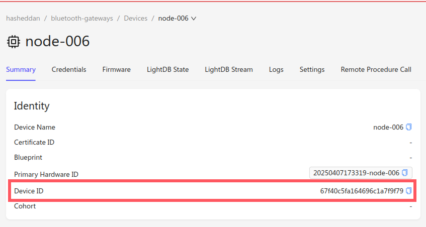

# Bluetooth Private Access

> [!CAUTION]
> Enrollment in the private access program is required to complete this
> onboarding guide. Complete [this
> form](https://hslp.golioth.io/bluetooth-cloud-early-access) to apply.


Welcome to the Golioth [Bluetooth-to-Cloud
Connectivity](https://blog.golioth.io/bluetooth-to-cloud/) private access
program! This guide provides all of the necessary information and artifacts to
start building [Bluetooth Low Energy
(BLE)](https://en.wikipedia.org/wiki/Bluetooth_Low_Energy) applications that
communicate with cloud services.

> [!NOTE]
> This repository may be updated at any time. If you are returning after
> previously completing some or all of the onboarding guide, make sure that you
> are using the latest gateway firmware images and the `pouch` SDK revision
> pinned in the git submodule.

## Background

Golioth recently launched support for cloud connectivity for devices that are
not directly connected to the platform. These devices communicate with the
platform via *gateways*. A gateway can take a variety of forms, such as a mobile
application or single board computer, but this guide will focus on the case in
which the gateway is simply another microcontroller-based device in the same
Golioth project. We refer to this scenario, where the gateway itself leverages
Golioth’s cloud services for OTA firmware updates, logging, and more, as a
[*managed
gateway*](https://blog.golioth.io/the-taxonomy-of-connected-device-networks/#industrial-machine-monitoring).

> [!NOTE]
> Learn more about all of the different gateway architectures [in this
> post](https://blog.golioth.io/the-taxonomy-of-connected-device-networks/).

At the protocol level, devices that communicate with Golioth via a gateway are
agnostic to the type and implementation of the gateway. This enables easily
swapping out one gateway for another when going from development to production,
or even leveraging multiple types of gateways in the final product. Because of
this, the private access program leverages pre-built firmware images for
specific gateway hardware, allowing you to focus on building the application
that runs on your Bluetooth devices.

These devices leverage Golioth’s new `pouch` SDK, which is designed for devices
that communicate over non-IP transports. BLE GATT is just the first of many
different transports that can be used with `pouch`.

## Prerequisites

The following items are required in order to complete the steps in this guide.

**Software**

- A Golioth project that has been enrolled in the Bluetooth-to-Cloud
  connectivity private access program.
- The
  [`nrfutil`](https://www.nordicsemi.com/Products/Development-tools/nRF-Util)
  CLI tool.
- All Zephyr
  [dependencies](https://docs.zephyrproject.org/latest/develop/getting_started/index.html),
  including the
  [`west`](https://docs.zephyrproject.org/latest/develop/west/index.html) CLI
  meta-tool. Zephyr itself will be downloaded later in this guide.

**Hardware**

- An [nRF9160
  DK](https://www.nordicsemi.com/Products/Development-hardware/nRF9160-DK) or
  [Thingy:91
  X](https://www.nordicsemi.com/Products/Development-hardware/Nordic-Thingy-91-X)
  to serve as a BLE to cellular gateway.
- One or more [Zephyr](https://zephyrproject.org/)-supported devices with BLE
  capabilities. We recommend the [nRF52840
  DK](https://www.nordicsemi.com/Products/Development-hardware/nRF52840-DK).

## Getting Started

> [!TIP]
> If you get stuck at any point in this guide, consult the [troubleshooting
> documentation](./TROUBLESHOOT.md) or reach out to us using one of the
> communication methods described in the [Feedback &
> Support](#feedback--support) section.

If you haven't already, get started by cloning this repository to your local
machine.

```
git clone https://github.com/golioth/ble-private-access.git
```

### 1. Prepare Your Golioth Project

You should already have a Golioth project that is enrolled in the private access
program. You can verify that a project is enrolled by ensuring that the
`Networks` tab is visible in the [console](https://console.golioth.io).

The first step in onboarding is creating and enabling a
[Pipeline](https://docs.golioth.io/data-routing) in your project that is capable
of routing data to [LightDB
Stream](https://docs.golioth.io/application-services/lightdb-stream/). To create
the [example Pipeline](./json-pipeline.yaml) from this repository in your
project, click
[here](https://console.golioth.io/pipeline?name=JSON%20to%20LightDB%20Stream&pipeline=ZmlsdGVyOgogIHBhdGg6ICIqIgogIGNvbnRlbnRfdHlwZTogYXBwbGljYXRpb24vanNvbgpzdGVwczoKICAtIG5hbWU6IHN0ZXAtMAogICAgZGVzdGluYXRpb246CiAgICAgIHR5cGU6IGxpZ2h0ZGItc3RyZWFtCiAgICAgIHZlcnNpb246IHYx).

### 2. Connecting the Gateway

The next step is connecting your gateway to your Golioth project.

1. [Create a
   device](https://docs.golioth.io/getting-started/console/register#creating-a-new-device)
   in the project. We recommend using tags to label the device as a gateway.
2. Copy the Pre-Shared Key (PSK) credentials for the device.
3. Program the gateway with a pre-built firmware image from this repository.

> [!NOTE]
> `nrfutil device` commands may require supplying `--serial-number
> <serial-number>` if multiple devices are connected to your local machine. Use
> `nrfutil device list` to obtain information about all connected devices.

**nRF9160 DK**

Position the SWD selection switch (`SW10`) to `nRF52` and issue the following
command.

```
nrfutil device program --firmware ./bin/gw/nrf9160dk/nrf52840.hex --x-family nrf52
```

Power cycle the device and position the SWD selection switch (`SW10`) to `nRF91`
and issue the following command.

```
nrfutil device program --firmware ./bin/gw/nrf9160dk/nrf9160.hex --x-family nrf91
```

**Thingy:91 X**

Position the SWD selection switch (`SW2`) to `nRF53` and issue the following
command.

```
nrfutil device x-execute-batch --batch-path ./bin/gw/thingy91x/nrf5340_batch.json
```

Power cycle the device and position the SWD selection switch (`SW2`) to `nRF91`
and issue the following command.

```
nrfutil device x-execute-batch --batch-path ./bin/gw/thingy91x/nrf9151_batch.json
```

4. Configure credentials on the gateway device using the shell.

```
settings set golioth/psk-id <my-psk-id@my-project>
```

```
settings set golioth/psk <my-psk>
```

5. Reboot the device.

```
kernel reboot cold
```

6. Verify that the gateway successfully connects to Golioth.

### 3. Building Your First BLE Firmware Application

Now that your gateway is connected, you can use the `pouch` SDK to build an
application.

1. Create a second device in the same Golioth project and copy its `Device ID`.



> [!IMPORTANT]
> Make sure to use the device's `Device ID` and not its PSK ID or PSK.

2. Ensure you are using the correct version of the `pouch` SDK.

```
git submodule update --init --recursive
```

3. Initialize the project.

```
west init -l ./pouch
```

4. Download Zephyr and dependencies.

```
west update --narrow -o=--depth=1
```

> [!NOTE]
> Zephyr and other libraries will now be present in the `/deps` directory of
> this repository.

5. Build the example BLE GATT application in the `pouch` SDK, replacing
   `REPLACME` with your device's `Device ID`.

```
west build -p -b nrf52840dk/nrf52840 pouch/examples/ble_gatt -- -DCONFIG_EXAMPLE_DEVICE_ID=\"REPLACME\"
```

> If not using the nRF52840 DK, make sure to replace it as the specified board
> in the command above.

6. Program the device.

```
west flash
```

### 4. Exploring Device Networks in the Golioth Console

The gateway will periodically sync the device, delivering data to Golioth on
behalf of the device. Data will be associated with the originating device, but
the relationship between the gateway and the device can also be observed.

1. Navigate to the `Networks` tab in your Golioth project.
2. Click on the node that corresponds to the gateway.
3. View the gateway’s network topology.


4. Click on the BLE device connected to the gateway.
5. Navigate to the BLE device's LightDB Stream tab to observe its payloads
   streaming to Golioth via the gateway.

### 5. Building Your Own BLE Application

The example application demonstrates a simple case of streaming hardcoded data
to Golioth. Try collecting real sensor data and streaming it, or program another
BLE device to observe multiple devices attached to the same gateway.

The `pouch` SDK can be added to an existing project by adding the following
under `projects` in the `west.yml` file.

```
    - name: pouch
      path: modules/lib/pouch
      revision: ed81c7d88d48b40519dc4a32d978618c85e44180
      url: https://github.com/golioth/pouch.git
```

## Feedback & Support

> [!TIP]
> Quick answers to frequently asked questions can be found in the
> [FAQ](./FAQ.md) document.

We are excited to hear from you! Customers enrolled in the private access
program will be provided with dedicated channels to provide feedback and request
support. For all other cases, please email
[`support@golioth.io`](mailto:support@golioth.io) or post on the Golioth
[forum](https://forum.golioth.io/).
